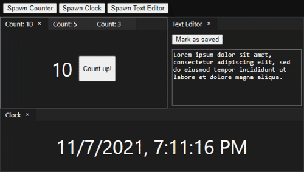

# react-dockable



An easy-to-use dockable window manager for React,
fully embracing hooks!

[Try it right now!](https://hlorenzi.github.io/react-dockable/)

Your custom content's lifecycle hooks are respected,
so `useState`, `useEffect`, etc. work out of the box,
and state carries over even if the user rearranges
their panels.

[![Discord][badge-discord-img]][badge-discord-url]

[badge-discord-img]: https://img.shields.io/discord/394999035540275222?label=Join%20the%20Discord%20server!&logo=discord
[badge-discord-url]: https://discord.com/invite/pXeDXGD

## Installation

```
npm install @hlorenzi/react-dockable
```

## Example

```tsx
import * as React from "react"
import * as Dockable from "@hlorenzi/react-dockable"

function App()
{
    // Create the base state,
    // and set up initial content
    const state = Dockable.useDockable((state) =>
    {
        Dockable.createDockedPanel(
            state, state.rootPanel, Dockable.DockMode.Full,
            <Counter/>)
    })

    // Render the root Container element,
    // which handles all interactions on your behalf
    return <div style={{
        width: "100vw",
        height: "100vh",
    }}>

        <Dockable.Container state={ state }/>

    </div>
}

// Your custom element!
function Counter()
{
    const [value, setValue] = React.useState(0)
    const countUp = () => setValue(value + 1)

    const ctx = Dockable.useContentContext()
    ctx.setTitle(`Count: ${ value }`)
    ctx.setPreferredSize(300, 250)

    return <div>
        { value }
        <button onClick={ countUp }>Count up!</button>
    </div>
}
```
